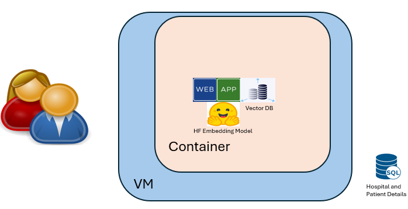
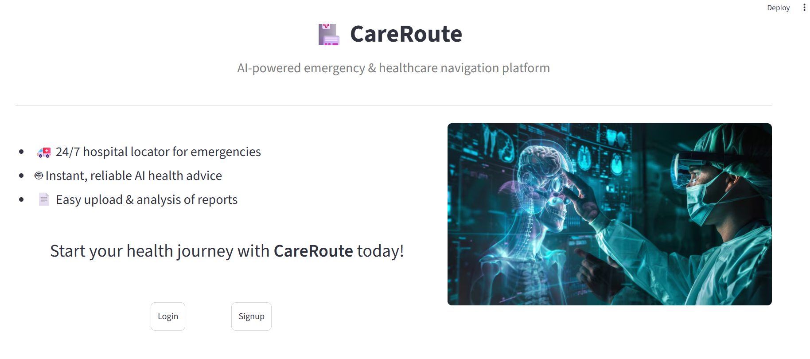

# AIXMedTech-hackathon

## CareRoute

## Solution Architecture

# 🏥 AI Triage & Medical Report Analyzer

This project is a AI-based healthcare assistant designed to help users:
- Understand their symptoms
- Analyze uploaded medical reports
- Get guidance on which medical department to consult
- Identify potential emergency situations early

⚠️ *Disclaimer*:  
This system is *not a medical diagnosis tool. It is intended **only for educational and experimental purposes* and should *not replace professional medical advice*.

---

## ✨ Features

### 1️⃣ AI Triage (RAG-based)
- Users enter:
  - Symptoms
  - Lab test results / report findings
- The system:
  - Retrieves similar historical patient cases from a *local vector database*
  - Uses semantic similarity (embeddings)
  - Suggests:
    - Relevant hospital department

---

### 2️⃣ Medical Report Analyzer
- Upload any medical report (text-based)
- AI extracts and summarizes:
  - Key findings
  - Report Summary(Hindi/English)
- Helps users understand complex reports in *simple language*

---

## 🧠 Solution Architecture Overview

User Input  
Streamlit Frontend  
        ↓  
Backend Logic (Python)  
        ↓  
Chunking (Symptoms / Clinical / Assessment)  
        ↓  
AI Embeddings  
        ↓  
In-Memory Vector Store  
        ↓  
Similarity Retrieval + Rules  
        ↓  
Application Logic Response

---

## 🧠 Application Workflow

User Input  
   ↓  
Symptoms + Reports  
   ↓  
NLP(AI Embeddings + Symantec Similarity)  
   ↓  
Report Analyzer  
   ↓  
AI Triage Engine  
   ↓  
Department Mapping  
   ↓  
Nearby Hospital Matching
   ↓  
Doctor Recommendation + Directions

---

## How to run locally

1️⃣ Clone the repository

git clone https://github.com/Harshcoder9/AIXMedTech-hackathon.git

cd AIXMedTech-hackathon

2️⃣ Install dependencies

pip install -r requirements.txt

3️⃣ Run the Streamlit app

streamlit run landing.py

PLEASE WAIT FOR FEW MINUTES BEFORE THE APPLICATION BECOMES FULLY OPERATIONAL AND YOU WOULD GET BELOW LANDING PAGE - As hospital patients vector database building takes few minutes.

